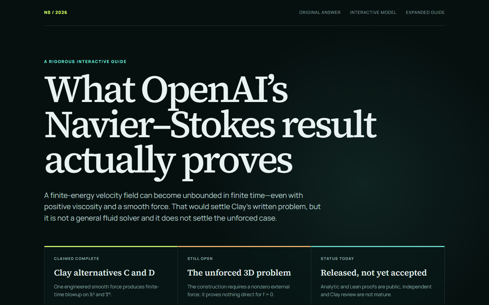

# OpenAI's Navier–Stokes Result, Explained

[](https://az9713.github.io/openai-navier-stokes-results/)

**[Open the live GitHub Pages site →](https://az9713.github.io/openai-navier-stokes-results/)**

An interactive, mathematically detailed guide to the scope, mechanism, significance, and limitations of OpenAI's claimed finite-time blowup result for the three-dimensional incompressible Navier–Stokes equations.

The guide distinguishes four questions that are often conflated:

- whether the result resolves the Clay Millennium Prize Problem as written;
- whether it settles the unforced three-dimensional regularity problem;
- whether it provides a general method for solving fluid flows; and
- what follows if the analytical PDF is independently verified.

It also includes an interactive scaling model of the concentrating vortex core. The visualization is pedagogical; it is not a numerical Navier–Stokes solver.

## Primary sources

- **Blog:** [On the Navier–Stokes Millennium Prize Problem](https://openai.com/index/navier-stokes-solution/)
- **GitHub:** [OpenAI/NavierStokesAndEuler](https://github.com/openai/NavierStokesAndEuler)
- **Paper:** [Finite Time Blowup for Navier–Stokes (PDF)](https://cdn.openai.com/pdf/32d9f210-8b73-45e0-91bc-82a30aef8a9a/navier-stokes.pdf)

## Central scope distinction

Assuming the PDF is correct, the construction resolves alternatives C and D in the official Clay formulation by producing finite-time blowup with a smooth, compactly supported external force. It does **not** decide whether every smooth unforced flow, with `f = 0`, remains globally regular.

## Run locally

```bash
npm install
npm run dev
```

Create the production build with:

```bash
npm run build
```

GitHub Actions creates a static export and deploys it to GitHub Pages after every push to `main`.
